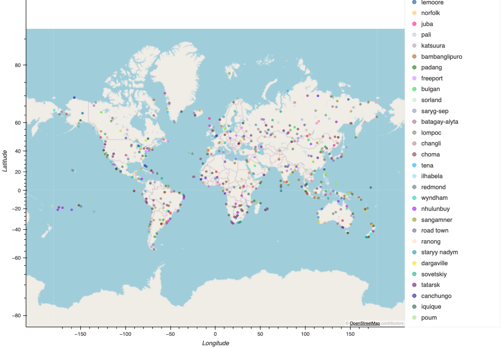

# Python API Challenge: Weather Analysis & Vacation Planning

## Background
This project aims to explore weather patterns by answering a fundamental question: **"What is the weather like as we approach the equator?"** Using Python, APIs, and JSON data, we analyze how weather attributes like temperature, humidity, cloudiness, and wind speed vary with latitude.

## Overview
The project is divided into two main parts:
1. **WeatherPy**: Visualizing weather conditions across 500+ cities based on their latitude.
2. **VacationPy**: Recommending vacation destinations based on weather preferences and nearby accommodations.

### Repository Contents
- **WeatherPy.ipynb**: Script for weather data collection and analysis.
- **VacationPy.ipynb**: Script for vacation planning based on weather conditions.

## Part 1: WeatherPy

In **WeatherPy**, we use the `citipy` library and OpenWeatherMap API to gather weather data for over 500 cities worldwide. The objective is to visualize the relationships between weather attributes and latitude through various plots:
- **Latitude vs. Temperature**
  

  
- **Latitude vs. Cloudiness**
  

- **Latitude vs. Wind Speed**
- 
  

We also compute linear regression for both the Northern and Southern Hemispheres to gain deeper insights into these relationships.

### Key Deliverables:
- Scatter plots for weather variables vs. latitude
- Linear regression models for both hemispheres
- Insights into how weather changes with proximity to the equator

## Part 2: VacationPy

In **VacationPy**, we utilize the weather data from Part 1 to plan vacations based on specific weather preferences. Using the Geoapify API, we find hotels near cities with ideal weather conditions.

### Steps:
1. **City Map**: Visualize cities with markers sized according to their humidity levels.
2. **Ideal Weather Filter**: Narrow down cities to those with desirable weather conditions (e.g., temperatures between 21°C-27°C, low wind speeds, and zero cloudiness).
3. **Hotel Search**: Use the Geoapify API to find hotels within 10,000 meters of selected cities and enrich the map with this information.

### Key Deliverables:
- Interactive map displaying cities based on weather conditions
- Hotel recommendations displayed with hover information (hotel name and country)

## Map Example

## How to Use

To run this project locally and generate the same analyses and visualizations, follow these steps:

### Prerequisites
1. Install Python 3.x.
2. Set up a virtual environment (optional, but recommended).
3. Install the following libraries:
   - `pandas`
   - `numpy`
   - `matplotlib`
   - `scipy`
   - `requests`
   - `citipy`
   - `geoViews`
   - `Geoapify`

### How to use

Clone the new repository to your computer.

The files called WeatherPy.ipynb and VacationPy.ipynb contain the codes for the weather and vacation components.
